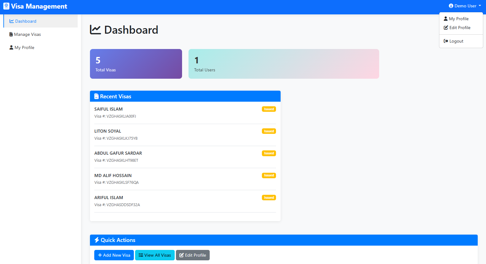
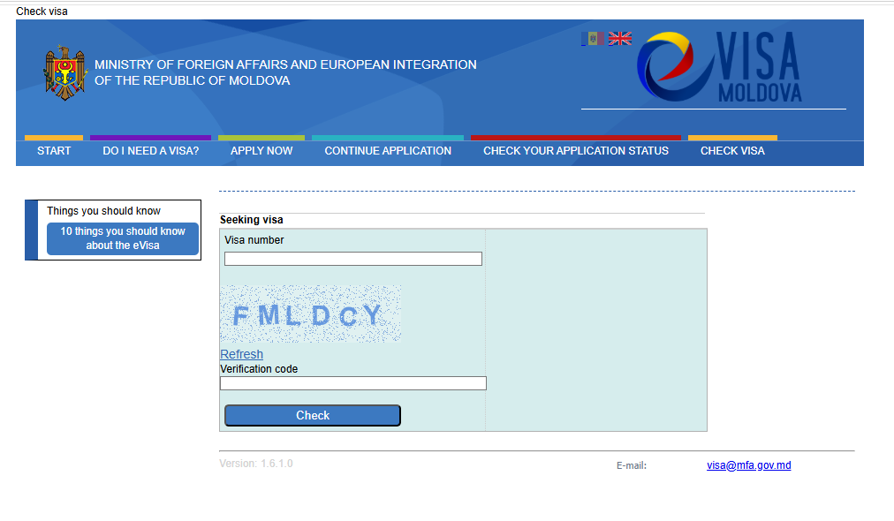
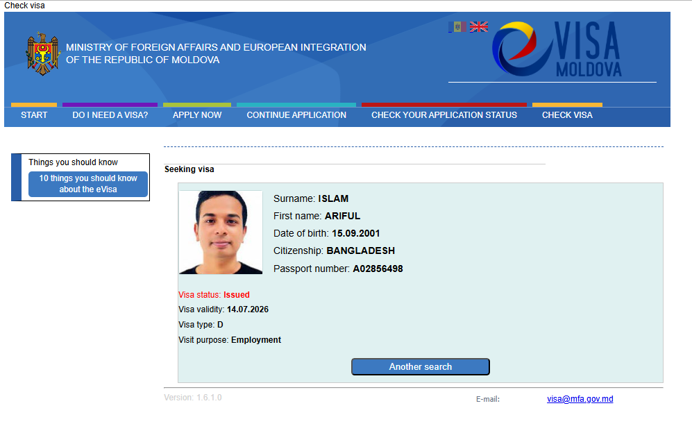

# Visa Management System (Inspired by Moldova Visa Portal)

A clean and efficient Visa Management application developed using the **Laravel 12** framework. This project is inspired by the **Moldova Visa Checking System**, focusing on core CRUD operations, secure file handling, and a realistic visa status inquiry flow.

## 🌟 Features

- **Moldova Portal Logic:** Designed to emulate the workflow of a real-world visa checking portal, allowing users to search and verify visa records.
- **Visa Records CRUD:** Complete Create, Read, Update, and Delete functionality for managing visa applications in the backend.
- **Secure File Upload:** Integrated document management allowing users/admins to attach and store visa-related files (e.g., PDF, Images) securely using Laravel Storage.
- **Custom Captcha Security:** A native, custom-built security layer using the PHP **GD Library**. It generates image-based captchas to protect the search and submission forms from automated spam.
- **Authentication System:** Integrated with Laravel's built-in secure authentication system to ensure authorized access to the administrative dashboard.
- **Robust Validation:** Strict server-side validation to ensure data integrity and secure file format handling.

## 📸 Screenshots

*(Visual overview of the application)*


*Dashboard List of Visa Records (Admin View)*


*Visa Search Form with Custom Captcha (Public View)*


*Visa Search Result Detail View*

---

## 🛠 Tech Stack

- **Backend:** Laravel 12 (PHP 8.x)
- **Frontend:** Blade Templates / Bootstrap
- **Database:** MySQL
- **Key Techniques:** - **PHP GD Library:** For generating the custom security captcha.
  - **Laravel Storage:** For managing secure document uploads.

## 🚀 Installation & Setup

Follow these steps to set up the project locally:

1. **Clone the repository:**
   ```bash
   git clone [https://github.com/mdanu444/Visa-Management-System.git](https://github.com/mdanu444/Visa-Management-System.git)
   cd Visa-Management-System
